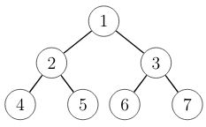

# Binääripuun toteutus (Java)

Miten binääripuu toteutetaan käytännössä Javalla? Seuraavassa on yksi hyvä toteutustapa, joka on käytössä tämän viikon tehtävissä.

## Luokka Node

Ideana on luoda luokka `Node`, joka vastaa yhtä binääripuun solmua. Luokassa on muuttujat `left` ja `right`, jotka viittaavat vasempaan ja oikeaan lapsisolmuun.

```java
public class Node {
    Node left, right;

    public Node(Node left, Node right) {
        this.left = left;
        this.right = right;
    }
}
```

Tämä luokka tallennetaa tiedostoon `Node.java`, jolloin sitä voi käyttää muista luokista.

## Puun luominen

Nyt voimme esittää minkä tahansa binääripuun `Node`-olioina. Tarkastellaan esimerkkinä seuraavaa binääripuuta:



Seuraava koodi luo jokaista solmua vastaavan olion ja asettaa lapset oikealla tavalla:

```java
Node node4 = new Node(null,null);
Node node5 = new Node(null,null);
Node node6 = new Node(null,null);
Node node7 = new Node(null,null);
Node node2 = new Node(node4,node5);
Node node3 = new Node(node6,node7);
Node node1 = new Node(node2,node3);
```

Yllä oleva koodi rakentaa puun alhaalta ylöspäin, jotta linkit lapsiin voidaan asettaa suoraan. Huomaa myös, että olioissa ei ole tietoa solmujen numeroista, vaan vain puun rakenne tallennetaan.

Toinen tapa rakentaa puu on muodostaa oliot sisäkkäin, jolloin joka solmulle ei luoda omaa muuttujaa. Voimme rakentaa äskeisen puun myös näin:

```java
Node tree = new Node(
    new Node(new Node(null,null),new Node(null,null)),
    new Node(new Node(null,null),new Node(null,null))
);
```

## Puun käsittely

Seuraava metodi laskee binääripuun solmujen määrän:

```java
public int count(Node node) {
    if (node == null) return 0;
    return count(node.left)+count(node.right)+1;
}
```

Tämä metodi vastaa Tirakirjan sivulla 61 annettua pseudokoodia. Ideana on laskea solmut rekursiivisesti ja lopettaa laskeminen, kun tullaan olemattomaan solmuun.

Huomaa, että tässä binääripuun toteutuksessa solmun sisältöön pääsee käsiksi suoraan (muuttujat `left` ja `right`) eikä luokassa ole erillisiä gettereitä ja settereitä. Tämä helpottaa binääripuun läpikäyntiä ja muuttamista.
